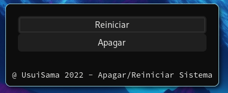

# POWEROFF REBOOT LINUX WITHOUT NOISE

## Descripción
Este proyecto tenía como finalidad la de evitar el pitido producido al enviar el mensaje de "poweroff".

## Preview

## Version

**c++17**

## Construido con 🛠️

- Lenguaje **C++**
- Glade [GTK]

## Autor ✒️

- **Usui, José Fernando** - _Diseño y Desarrollo del Sistema_

## Contacto 📱

- Gmail: _joesesilvae@gmail.com_